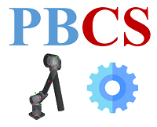

## PyBullet Control Suit

Implementation of [Modern Robotics](http://hades.mech.northwestern.edu/index.php/Modern_Robotics) in [PyBullet](https://github.com/bulletphysics/bullet3) simulator.

### Kinematics
* forward_kin.py
* inverse_kin.py
* jacobian.py

### Trajectory Generation
* third_poly_fit.py
* fifth_poly_fit.py

### Motion Plan
* rrt_motion_plan.py
* prm_motion_plan.py
* potential_field_motion_plan.py

### Control
* velocity_control.py
* compute_torque_control.py
* force_control.py
* hybrid_motion_force_control.py
* impedance_control.py